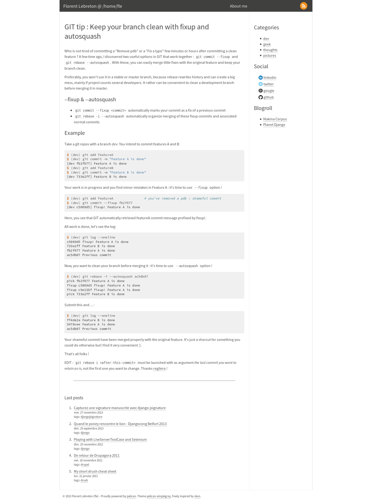

# simplegrey #title: (.*)
date: 2021-03-31

date: 2021-03-30

title: (.*)
date: 2021-03-31

date: 2021-03-30

``PELICAN_SIMPLEGREY_TWITTER_CARD_ACCOUNT = '__fle__' `` option allows you add [Twitter summary card metadata](https://dev.twitter.com/docs/cards/types/summary-card) in your posts title: (.*)
date: 2021-03-31

date: 2021-03-30

* Theme freely inspired by [vkvn](https://github.com/vkvn)
* Icons by [Jorge Calvo](http://dribbble.com/shots/1074961-Flat-Icons-EPS), slightly adapted by [Ingrid Hamard](http://ingrid.hamard.free.fr)

